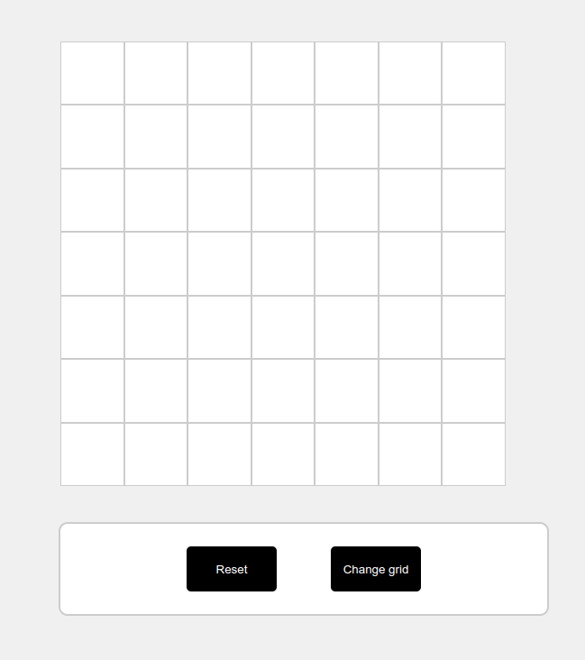

# Etch-A-Sketch

A fun, interactive Etch-A-Sketch web application built using HTML, CSS, and JavaScript. Create pixel art by hovering over a grid of divs, with options to reset and change the grid size.

## Table of Contents

- [Demo](#demo)
- [Features](#features)
- [Installation](#installation)

## Demo

Check out the live demo: [Etch-A-Sketch](https://christian783.github.io/Etch-a-Sketch/)



## Features

- **Interactive Drawing**: Draw by hovering over the grid.
- **Reset Grid**: Clear the grid with a reset button.
- **Change Grid Size**: Dynamically change the grid size with user input.
- **Responsive Design**: Adapts to different screen sizes using Flexbox.

## Installation

1. **Clone the repository:**
   ```bash
   git clone https://github.com/yourusername/etch-a-sketch.git
   cd etch-a-sketch
